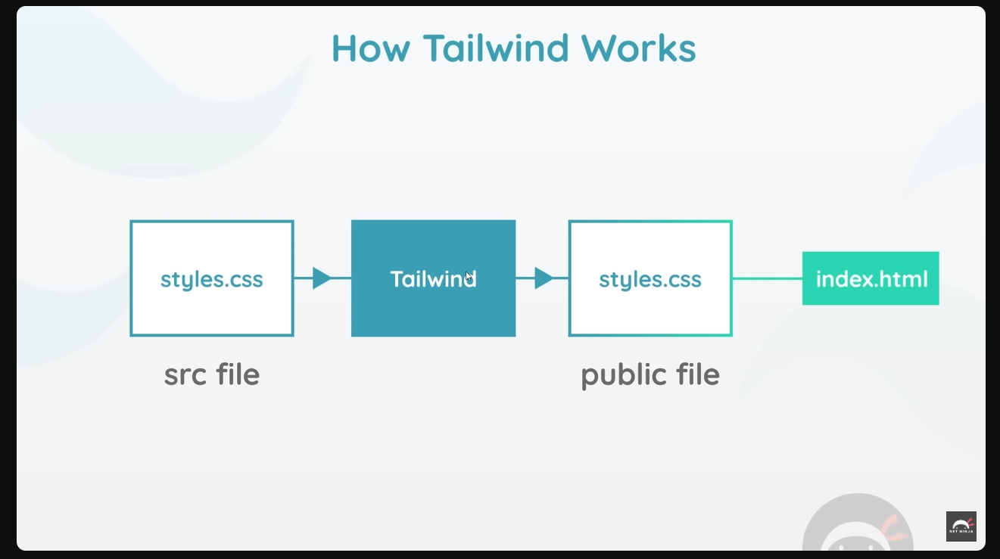

## Tailwind CSS Net Ninja
https://www.youtube.com/watch?v=bxmDnn7lrnk&list=PL4cUxeGkcC9gpXORlEHjc5bgnIi5HEGhw&index=1&t=14s

Does not give you fully styled components
Ovverides default browser styles
Typography and spacing, 
Card Components

npm init -y
npm i tailwindcss

## How tailwind works

Colors
-Tailwind documentation has color palette
-You shouldn't have black text on a white background, a softer gray looks better text-gray-600

## Margin, padding, Borders
px, p, py, pb, pt,pl,pr
mx, m, my, mb, mt,mr,mr

border - 1px all around
border-0 , bordr-2, border-4
border-t-0, border-l-4
border-gray-200, border-green-500

## Tailwind Config and theme
The default configuration is used by tailwind which dictatets the default values
We can ovveride or extend these value
- npx tailwindcss init --full
    - creates a adefault file with all the tailwind classes used under the hood
    - it is not recommednded to change values under the default config setup , makes it hard to know the default from the updated values
- npx tailwindcss init 
    - creates a blank configuration file
    - You can add new variables in the default config
    - Use it to extend, i.e if the lack a default color you may be needing

## Custom fonts
- grabbing custom fonts from google and adding them to the styles.css and using them in the tailwind config

## FlexBox
- flex items, flex container
- class="flex justify-center" //center an element
## Css Grid

## Responsive design
- responsive classes
- Tailwind is all about mobile first approach, all styles you apply will apply to all widths including mobile
- only apply to that size and up
    - sm:640px  //small screen n up
    - md:768px
    - lg:1024px
    - xl:1280px

- can create a custom class for font-sizes across different screens